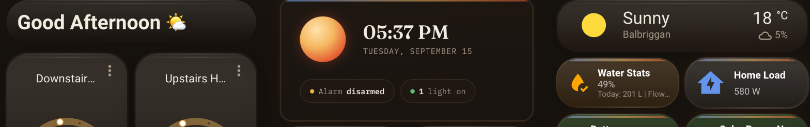

# Nova theme for Home Assistant



A dark Home Assistant frontend theme built from [Nova](https://github.com/abz2much/NOVA)'s
own "stellar core" visual identity — ember (`#e2542f`) and gold (`#f4b860`) accents on warm
dark surfaces, in place of the default HA blue. Every color in `themes/nova.yaml` is pulled
directly from the CSS custom properties in Nova's own panel
(`custom_components/nova/frontend/nova-panel-new.js`), not reinterpreted.

Dark-only, on purpose — Nova's own panel has no light variant, so this theme doesn't invent one.

This repo installs only Nova. It's one of several themes developed together in a local
workspace — see [abz2much](https://github.com/abz2much?tab=repositories&q=ha-theme) for others
as they're published, each as its own repo so you only install what you actually want.

## Install via HACS

1. HACS → the three-dot menu → **Custom repositories**.
2. Add this repository's URL, category **Theme**.
3. Install **Nova**, then restart Home Assistant (or reload themes from
   **Developer Tools → YAML → Themes**).
4. Set the theme from your user profile (bottom-left avatar → **Theme**).

## Install manually

1. Copy `themes/nova.yaml` into your Home Assistant `config/themes/` directory.
2. Make sure `configuration.yaml` loads that folder:
   ```yaml
   frontend:
     themes: !include_dir_merge_named themes
   ```
3. Restart Home Assistant, then set **Nova** as your theme from your user profile.

## Fonts

The theme uses **Manrope** for body text and **IBM Plex Mono** for anything
data-shaped (state values, timestamps). Home Assistant themes can't load web
fonts on their own — add this as a dashboard resource so the fonts are
actually fetched, or the theme silently falls back to your system sans-serif:

**Settings → Dashboards → ⋮ → Resources → Add Resource**
- URL: `https://fonts.googleapis.com/css2?family=Manrope:wght@400;500;600;700;800&family=IBM+Plex+Mono:wght@400;500;600&display=swap`
- Resource type: **CSS Stylesheet**

Or, in YAML-mode dashboards:
```yaml
lovelace:
  resources:
    - url: https://fonts.googleapis.com/css2?family=Manrope:wght@400;500;600;700;800&family=IBM+Plex+Mono:wght@400;500;600&display=swap
      type: css
```

Nova's panel also uses **Fraunces** for large display headings, but Home
Assistant's theme variables don't expose a separate heading-font hook — there's
nowhere in core HA's CSS for it to attach to, so it's left out rather than
forced in somewhere it wouldn't read correctly.

## Background and card-mod accents

The theme sets `lovelace-background`, a soft ember radial glow behind the
whole dashboard (the same treatment as the hero in Nova's own panel,
generalized across the page) — this needs nothing extra, it's a plain theme
variable.

It also carries a small optional **card-mod** section: a thin cool-to-ember
accent stripe across the top of every card, and a soft ember glow on hover.
This only does anything if you have the [card-mod](https://github.com/thomasloven/lovelace-card-mod)
HACS integration installed — if you don't, Home Assistant just ignores those
extra theme keys. Unlike the rest of this theme, card-mod styling isn't
validated by Home Assistant at load time (card-mod is a separate integration
reading its own keys out of the theme), so a mistake there fails silently
rather than erroring — if it doesn't look right, it's worth checking with
card-mod's own inspector rather than assuming the theme itself is broken.

## Scope and upkeep

This covers Home Assistant's stable, long-standing theme variable surface —
core colors, sidebar, header, cards, dialogs, sliders/switches, state and
semantic colors, label badges, tables, and fonts. HA occasionally adds new
theme variables in newer frontend releases; if something in a very recent HA
version doesn't pick up the theme, it's likely a variable added after this
was written rather than a bug in the palette itself.

If Nova's own panel palette changes in the future, update the token comments
in `themes/nova.yaml` against the current `:host{...}` block in
`custom_components/nova/frontend/nova-panel-new.js` and carry the new values
through — every themed value traces back to that one source.
